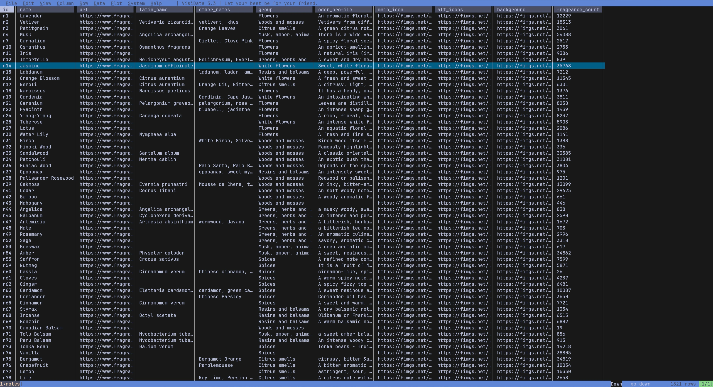
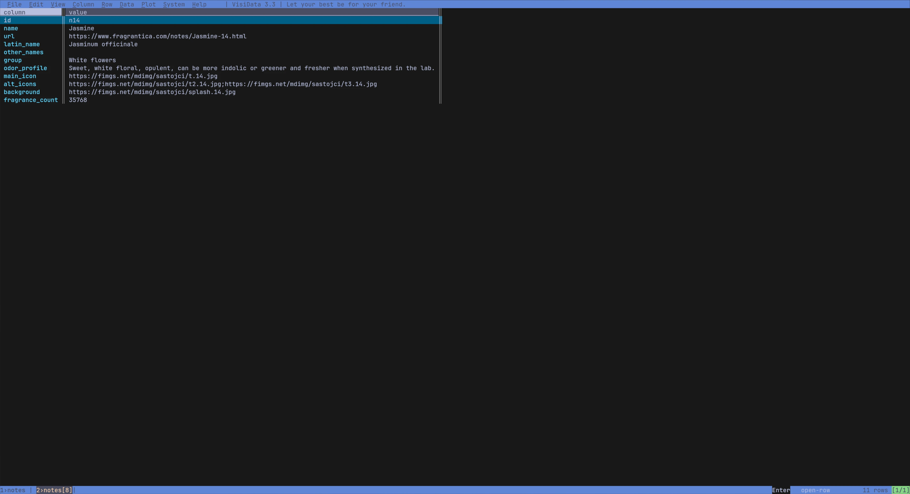

# FragDB - Fragrantica Fragrance Database

The most comprehensive fragrance database available, containing **135,000+ records** across five interconnected CSV files.

[](LICENSE.md)
[](https://fragdb.net)
[](DATA_DICTIONARY.md)
[](docs/VERSION_3.0_RELEASE.md)

## Overview

FragDB provides structured data for the fragrance industry:

| File | Records | Fields | Description |
|------|---------|--------|-------------|
| `fragrances.csv` | 122,367 | 30 | Main fragrance database |
| `brands.csv` | 7,344 | 10 | Brand/designer profiles |
| `perfumers.csv` | 2,825 | 11 | Perfumer (nose) profiles |
| `notes.csv` | 2,459 | 11 | Fragrance notes reference |
| `accords.csv` | 92 | 5 | Accords with colors |

### Key Features

- **Relational structure** — Files linked via unique IDs
- **Rich fragrance data** — Notes pyramid, accords, ratings, votes
- **Brand profiles** — Logo, country, website, parent company
- **Perfumer profiles** — Photo, status, company, education, biography
- **Notes reference** — Latin names, groups, odor profiles, images
- **Accords reference** — Display colors for visualizations
- **Pipe-delimited CSV** — Easy parsing, UTF-8 encoded

## Preview

### Fragrances

<p align="center">
  
  &nbsp;&nbsp;
  
</p>

### Brands & Perfumers

<p align="center">
  
  &nbsp;&nbsp;
  
</p>

### Notes

<p align="center">
  
  &nbsp;&nbsp;
  
</p>

## Quick Start

### Python

```python
import pandas as pd

# Load all five files
fragrances = pd.read_csv('fragrances.csv', sep='|', encoding='utf-8')
brands = pd.read_csv('brands.csv', sep='|', encoding='utf-8')
perfumers = pd.read_csv('perfumers.csv', sep='|', encoding='utf-8')
notes = pd.read_csv('notes.csv', sep='|', encoding='utf-8')
accords = pd.read_csv('accords.csv', sep='|', encoding='utf-8')

# Extract brand_id from brand field
fragrances['brand_id'] = fragrances['brand'].str.split(';').str[1]

# Join with brand details
df = fragrances.merge(brands, left_on='brand_id', right_on='id', suffixes=('', '_brand'))

# Parse voting field (new format: category:votes:percent)
def parse_votes(value):
    if not value: return {}
    return {p.split(':')[0]: {'votes': int(p.split(':')[1]), 'pct': float(p.split(':')[2])}
            for p in value.split(';') if ':' in p}

# Search by name
results = df[df['name'].str.contains('Aventus', case=False, na=False)]
print(results[['name', 'name_brand', 'country', 'year']])
```

### JavaScript

```javascript
const { parse } = require('csv-parse/sync');
const fs = require('fs');

// Load all five files
const fragrances = parse(fs.readFileSync('fragrances.csv', 'utf-8'), { columns: true, delimiter: '|' });
const brands = parse(fs.readFileSync('brands.csv', 'utf-8'), { columns: true, delimiter: '|' });
const perfumers = parse(fs.readFileSync('perfumers.csv', 'utf-8'), { columns: true, delimiter: '|' });
const notes = parse(fs.readFileSync('notes.csv', 'utf-8'), { columns: true, delimiter: '|' });
const accords = parse(fs.readFileSync('accords.csv', 'utf-8'), { columns: true, delimiter: '|' });

// Create lookup maps
const brandsMap = new Map(brands.map(b => [b.id, b]));
const perfumersMap = new Map(perfumers.map(p => [p.id, p]));
const notesMap = new Map(notes.map(n => [n.id, n]));
const accordsMap = new Map(accords.map(a => [a.id, a]));

// Parse voting field (new format: category:votes:percent)
const parseVotes = (value) => Object.fromEntries(
  (value || '').split(';').filter(p => p.includes(':')).map(p => {
    const [cat, votes, pct] = p.split(':');
    return [cat, { votes: +votes, pct: +pct }];
  })
);

// Get brand details for a fragrance
const fragrance = fragrances[0];
const [brandName, brandId] = fragrance.brand.split(';');
const brandDetails = brandsMap.get(brandId);
console.log(`${fragrance.name} by ${brandName} (${brandDetails?.country})`);
```

### SQL

```sql
-- Create tables
CREATE TABLE fragrances (
    pid INTEGER PRIMARY KEY,
    name VARCHAR(500),
    brand VARCHAR(500),  -- format: brand_name;brand_id
    reviews_count INTEGER,
    -- ... see full schema in examples/sql/
);

CREATE TABLE brands (
    id VARCHAR(20) PRIMARY KEY,  -- format: b1, b2, ...
    name VARCHAR(500),
    country VARCHAR(100)
);

CREATE TABLE perfumers (
    id VARCHAR(20) PRIMARY KEY,  -- format: p1, p2, ...
    name VARCHAR(500),
    company VARCHAR(200)
);

CREATE TABLE notes (
    id VARCHAR(20) PRIMARY KEY,  -- format: n1, n2, ...
    name VARCHAR(200),
    latin_name VARCHAR(200),
    "group" VARCHAR(100)
);

CREATE TABLE accords (
    id VARCHAR(20) PRIMARY KEY,  -- format: a1, a2, ...
    name VARCHAR(100),
    bar_color VARCHAR(10),
    font_color VARCHAR(10)
);

-- Join fragrances with brands
SELECT f.name, b.name AS brand, b.country
FROM fragrances f
JOIN brands b ON SPLIT_PART(f.brand, ';', 2) = b.id;
```

See [examples/](examples/) for complete code in Python, JavaScript, SQL, and R.

## Data Structure

### fragrances.csv (30 fields)

#### Identity & Basic Info
| Field | Description | Format |
|-------|-------------|--------|
| `pid` | Unique fragrance identifier | Integer: `9828` |
| `url` | Direct link to fragrance page | URL |
| `brand` | Brand name and ID reference | `Creed;b1` |
| `name` | Fragrance name | Text: `Aventus` |
| `year` | Release year | Integer: `2010` |
| `gender` | Target gender | `for men`, `for women`, `for women and men` |
| `collection` | Collection within brand | Text |

#### Media
| Field | Description | Format |
|-------|-------------|--------|
| `main_photo` | Main bottle photo URL | URL |
| `info_card` | Social card image URL | URL |
| `user_photoes` | User-submitted photos | Semicolon-separated URLs |
| `video_url` | YouTube video URLs | Semicolon-separated URLs |

#### Composition
| Field | Description | Format |
|-------|-------------|--------|
| `accords` | Scent accords with intensity | `a24:100;a34:64;a38:60` (join with accords.csv) |
| `notes_pyramid` | Notes by layer with significance | `top(name,id,img,opacity,weight;...)middle(...)base(...)` |
| `perfumers` | Perfumer names and ID references | `Erwin Creed;p1;Olivier Creed;p2` |
| `description` | Fragrance description | HTML text |

#### Ratings & Votes (format: `category:votes:percent`)
| Field | Description | Format |
|-------|-------------|--------|
| `rating` | Average rating & vote count | `4.33;24561` |
| `reviews_count` | Total number of reviews | Integer: `793` |
| `appreciation` | Love/like/ok/dislike/hate | `love:12:13;like:48:53;ok:1:1;...` |
| `price_value` | Price perception votes | `way_overpriced:0:0;overpriced:2:29;...` |
| `gender_votes` | Gender suitability votes | `female:5:63;unisex:2:25;male:0:0;...` |
| `longevity` | Duration votes | `very_weak:4:18;moderate:8:36;long_lasting:3:14;...` |
| `sillage` | Projection votes | `intimate:5:19;moderate:11:42;strong:5:19;...` |
| `season` | Seasonal suitability | `winter:8:18;spring:15:33;summer:30:67;fall:12:27` |
| `time_of_day` | Day/night suitability | `day:45:100;night:5:11` |

#### Related & AI
| Field | Description | Format |
|-------|-------------|--------|
| `pros_cons` | AI-generated pros/cons | `pros(text,likes,dislikes;...)cons(...)` |
| `by_designer` | Same brand fragrances | Semicolon-separated PIDs |
| `in_collection` | Same collection fragrances | Semicolon-separated PIDs |
| `reminds_of` | Similar fragrances with votes | `pid:likes:dislikes;...` |
| `also_like` | Recommended fragrances | Semicolon-separated PIDs |
| `news_ids` | Related news article IDs | Semicolon-separated IDs |

### brands.csv (10 fields)

| Field | Description | Example |
|-------|-------------|---------|
| `id` | Unique brand identifier | `b1` |
| `name` | Brand name | `Creed` |
| `url` | Fragrantica brand page | `https://www.fragrantica.com/designers/Creed.html` |
| `logo_url` | Brand logo image | URL |
| `country` | Country of origin | `France` |
| `main_activity` | Primary business | `Fragrance house` |
| `website` | Official website | `https://www.creed.com` |
| `parent_company` | Parent company | `Kering` |
| `description` | Brand description | HTML text |
| `brand_count` | Number of fragrances | `847` |

### perfumers.csv (11 fields)

| Field | Description | Example |
|-------|-------------|---------|
| `id` | Unique perfumer identifier | `p1` |
| `name` | Perfumer name | `Alberto Morillas` |
| `url` | Fragrantica perfumer page | URL |
| `photo_url` | Perfumer photo | URL |
| `status` | Professional status | `Master Perfumer` |
| `company` | Current company | `Firmenich` |
| `also_worked` | Previous companies | `Quest International, Givaudan` |
| `education` | Education | `ISIPCA` |
| `web` | Personal website | URL |
| `perfumes_count` | Number of fragrances | `538` |
| `biography` | Biography | HTML text |

### notes.csv (11 fields)

| Field | Description | Example |
|-------|-------------|---------|
| `id` | Unique note identifier | `n80` |
| `name` | Note name | `Orange` |
| `url` | Fragrantica note page | URL |
| `latin_name` | Latin/scientific name | `Citrus sinensis` |
| `other_names` | Alternative names | `Sweet Orange, Naranja` |
| `group` | Note category | `Citrus smells` |
| `odor_profile` | Odor description | Text |
| `main_icon` | Note icon URL | URL |
| `alt_icons` | Alternative icons | Semicolon-separated URLs |
| `fragrance_count` | Fragrances with this note | `12847` |

### accords.csv (5 fields)

| Field | Description | Example |
|-------|-------------|---------|
| `id` | Unique accord identifier | `a24` |
| `name` | Accord name | `fruity` |
| `bar_color` | Background color (hex) | `#FC4B29` |
| `font_color` | Text color (hex) | `#000000` |
| `fragrance_count` | Fragrances with this accord | `45821` |

**[View complete data dictionary with parsing examples →](DATA_DICTIONARY.md)**

## Sample Data

The free sample includes **10 records per file** across all five CSV files:

| File | Records | Description |
|------|---------|-------------|
| [fragrances.csv](samples/fragrances.csv) | 10 | Iconic fragrances |
| [brands.csv](samples/brands.csv) | 10 | Brand profiles |
| [perfumers.csv](samples/perfumers.csv) | 10 | Perfumer profiles |
| [notes.csv](samples/notes.csv) | 10 | Fragrance notes (11 fields) |
| [accords.csv](samples/accords.csv) | 10 | Accords with colors |

Preview: [SAMPLE_PREVIEW.md](SAMPLE_PREVIEW.md)

## Code Examples

| Language | Files | Description |
|----------|-------|-------------|
| Python | [examples/python/](examples/python/) | Pandas loading, joining, search, recommendations |
| JavaScript | [examples/javascript/](examples/javascript/) | Node.js parsing, Express API |
| SQL | [examples/sql/](examples/sql/) | PostgreSQL/MySQL schemas with JOINs |
| R | [examples/r/](examples/r/) | Analysis, visualization with tidyverse |

## Documentation

- [DATA_DICTIONARY.md](DATA_DICTIONARY.md) - Complete field documentation
- [docs/VERSION_2.0_RELEASE.md](docs/VERSION_2.0_RELEASE.md) - Version 2.0 release notes & migration guide
- [docs/INTEGRATION_GUIDE.md](docs/INTEGRATION_GUIDE.md) - Platform integration guide
- [docs/USE_CASES.md](docs/USE_CASES.md) - Industry use cases
- [docs/FAQ.md](docs/FAQ.md) - Frequently asked questions

## Use Cases

- **E-commerce**: Enrich product listings with detailed fragrance data
- **Mobile Apps**: Build fragrance collection managers or discovery apps
- **Data Analysis**: Analyze fragrance industry trends by brand, country, perfumer
- **Recommendations**: Build content-based or collaborative filtering systems
- **Content Creation**: Power blogs, videos, and reviews with accurate data

## Full Database

The free sample contains 10 records per file. The full FragDB database includes:

| Feature | Free Sample | Full Database |
|---------|-------------|---------------|
| Fragrances | 10 | 122,367 |
| Brands | 10 | 7,344 |
| Perfumers | 10 | 2,825 |
| Notes | 10 | 2,459 |
| Accords | 10 | 92 |
| Total Records | 50 | 135,087 |
| Data Fields | 67 | 67 |
| Updates | None | Regular |
| Commercial Use | Yes (sample) | Yes (licensed) |

**[Purchase at fragdb.net →](https://fragdb.net)**

## Contributing

Contributions are welcome! See [CONTRIBUTING.md](CONTRIBUTING.md) for guidelines.

- Bug fixes for code examples
- New language examples
- Documentation improvements
- Use case additions

## License

- **Sample Data & Code**: [MIT License](LICENSE.md)
- **Full Database**: Commercial license (see [fragdb.net](https://fragdb.net))

## Links

- **Website**: [fragdb.net](https://fragdb.net)
- **Kaggle**: [kaggle.com/datasets/eriklindqvist/fragdb-fragrance-database](https://www.kaggle.com/datasets/eriklindqvist/fragdb-fragrance-database)
- **Hugging Face**: [huggingface.co/datasets/FragDBnet/fragrance-database](https://huggingface.co/datasets/FragDBnet/fragrance-database)
- **Documentation**: [DATA_DICTIONARY.md](DATA_DICTIONARY.md)
- **Issues**: [GitHub Issues](../../issues)

---

Built with data passion by the FragDB team.
