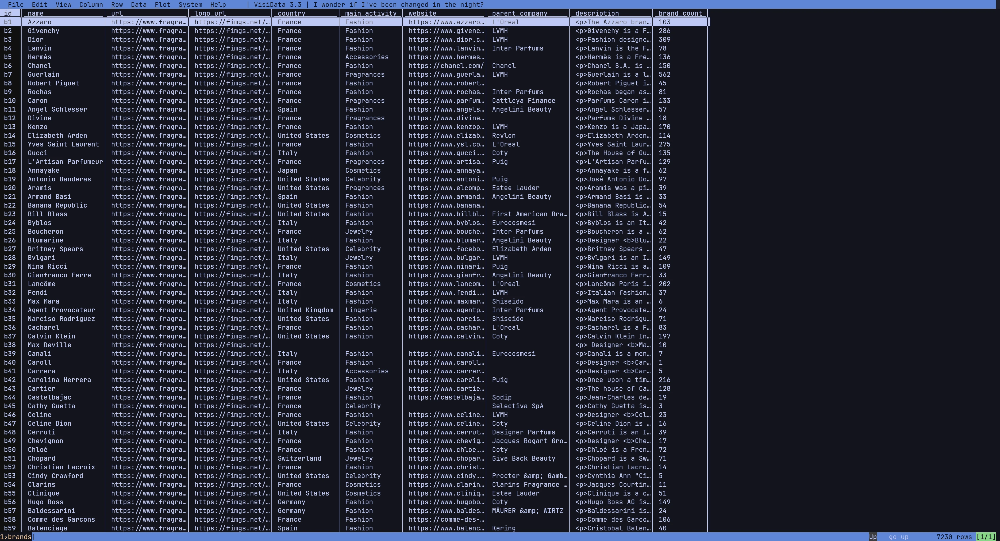
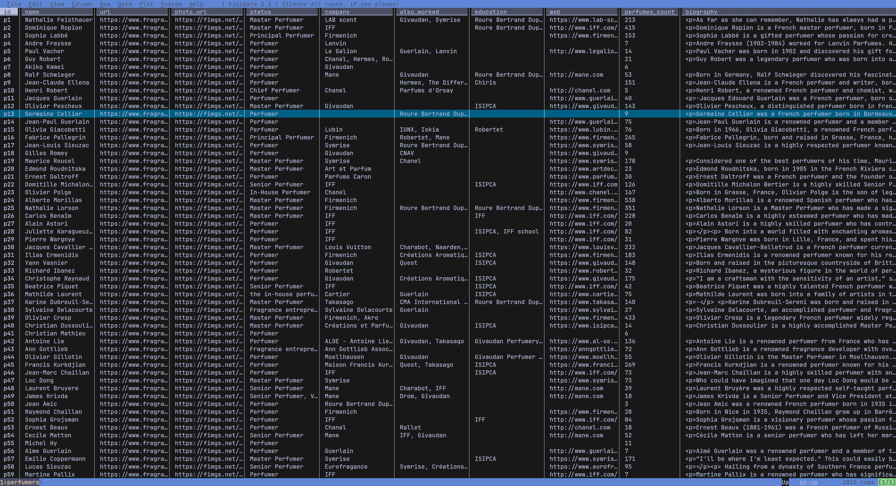

# FragDB - Fragrance Database

The most comprehensive fragrance database available, containing **129,000+ records** across three interconnected CSV files.

[](LICENSE.md)
[](https://fragdb.net)
[](DATA_DICTIONARY.md)
[](docs/VERSION_2.0_RELEASE.md)

## Overview

FragDB provides structured data for the fragrance industry:

| File | Records | Fields | Description |
|------|---------|--------|-------------|
| `fragrances.csv` | 119,000+ | 28 | Main fragrance database |
| `brands.csv` | 7,200+ | 10 | Brand/designer profiles |
| `perfumers.csv` | 2,700+ | 11 | Perfumer (nose) profiles |

### Key Features

- **Relational structure** — Files linked via unique IDs
- **Rich fragrance data** — Notes pyramid, accords, ratings, votes
- **Brand profiles** — Logo, country, website, parent company
- **Perfumer profiles** — Photo, status, company, education, biography
- **Pipe-delimited CSV** — Easy parsing, UTF-8 encoded

## Preview

### Fragrances

<p align="center">
  
  &nbsp;&nbsp;
  
</p>

### Brands & Perfumers (v2.0)

<p align="center">
  
  &nbsp;&nbsp;
  
</p>

## Quick Start

### Python

```python
import pandas as pd

# Load all three files
fragrances = pd.read_csv('fragrances.csv', sep='|', encoding='utf-8')
brands = pd.read_csv('brands.csv', sep='|', encoding='utf-8')
perfumers = pd.read_csv('perfumers.csv', sep='|', encoding='utf-8')

# Extract brand_id from brand field
fragrances['brand_id'] = fragrances['brand'].str.split(';').str[1]

# Join with brand details
df = fragrances.merge(brands, left_on='brand_id', right_on='id', suffixes=('', '_brand'))

# Search by name
results = df[df['name'].str.contains('Aventus', case=False, na=False)]
print(results[['name', 'name_brand', 'country', 'year']])
```

### JavaScript

```javascript
const { parse } = require('csv-parse/sync');
const fs = require('fs');

// Load all files
const fragrances = parse(fs.readFileSync('fragrances.csv', 'utf-8'), { columns: true, delimiter: '|' });
const brands = parse(fs.readFileSync('brands.csv', 'utf-8'), { columns: true, delimiter: '|' });
const perfumers = parse(fs.readFileSync('perfumers.csv', 'utf-8'), { columns: true, delimiter: '|' });

// Create lookup maps
const brandsMap = new Map(brands.map(b => [b.id, b]));
const perfumersMap = new Map(perfumers.map(p => [p.id, p]));

// Get brand details for a fragrance
const fragrance = fragrances[0];
const [brandName, brandId] = fragrance.brand.split(';');
const brandDetails = brandsMap.get(brandId);
console.log(`${fragrance.name} by ${brandName} (${brandDetails?.country})`);
```

### SQL

```sql
-- Create tables
CREATE TABLE fragrances (
    pid INTEGER PRIMARY KEY,
    name VARCHAR(500),
    brand VARCHAR(500),  -- format: brand_name;brand_id
    -- ... see full schema in examples/sql/
);

CREATE TABLE brands (
    id VARCHAR(20) PRIMARY KEY,  -- format: b1, b2, ...
    name VARCHAR(500),
    country VARCHAR(100),
    -- ... see full schema in examples/sql/
);

CREATE TABLE perfumers (
    id VARCHAR(20) PRIMARY KEY,  -- format: p1, p2, ...
    name VARCHAR(500),
    company VARCHAR(200),
    -- ... see full schema in examples/sql/
);

-- Join fragrances with brands
SELECT f.name, b.name AS brand, b.country
FROM fragrances f
JOIN brands b ON SPLIT_PART(f.brand, ';', 2) = b.id;
```

See [examples/](examples/) for complete code in Python, JavaScript, SQL, and R.

## Data Structure

### fragrances.csv (28 fields)

#### Identity & Basic Info
| Field | Description | Format |
|-------|-------------|--------|
| `pid` | Unique fragrance identifier | Integer: `9828` |
| `url` | Direct link to fragrance page | URL |
| `brand` | Brand name and ID reference | `Creed;b1` |
| `name` | Fragrance name | Text: `Aventus` |
| `year` | Release year | Integer: `2010` |
| `gender` | Target gender | `for men`, `for women`, `for women and men` |
| `collection` | Collection within brand | Text |

#### Media
| Field | Description | Format |
|-------|-------------|--------|
| `main_photo` | Main bottle photo URL | URL |
| `info_card` | Social card image URL | URL |
| `user_photoes` | User-submitted photos | Semicolon-separated URLs |

#### Composition
| Field | Description | Format |
|-------|-------------|--------|
| `accords` | Scent accords with strength & colors | `fruity:100:#FC4B29:#000;woody:67:#774414:#FFF` |
| `notes_pyramid` | Notes by layer (top/middle/base) | `top(Bergamot,url,img;...)middle(...)base(...)` |
| `perfumers` | Perfumer names and ID references | `Erwin Creed;p1;Olivier Creed;p2` |
| `description` | Fragrance description | HTML text |

#### Ratings & Votes
| Field | Description | Format |
|-------|-------------|--------|
| `rating` | Average rating & vote count | `4.33;24561` |
| `appreciation` | Love/like/ok/dislike/hate | `love:100;like:42.23;ok:11.85;...` |
| `price_value` | Price perception votes | `way_overpriced:6658;overpriced:2844;...` |
| `ownership` | Ownership status | `have_it:52.82;had_it:12.32;want_it:34.86` |
| `gender_votes` | Gender suitability votes | `female:149;unisex:866;male:7977;...` |
| `longevity` | Duration votes | `very_weak:784;weak:1459;moderate:5869;...` |
| `sillage` | Projection votes | `intimate:1816;moderate:8139;strong:4289;...` |
| `season` | Seasonal suitability | `winter:44.39;spring:97.60;summer:99.48;fall:74.81` |
| `time_of_day` | Day/night suitability | `day:100.00;night:68.93` |

#### Related Fragrances
| Field | Description | Format |
|-------|-------------|--------|
| `by_designer` | Same brand fragrances | Semicolon-separated PIDs |
| `in_collection` | Same collection fragrances | Semicolon-separated PIDs |
| `reminds_of` | Similar fragrances | Semicolon-separated PIDs |
| `also_like` | Recommended fragrances | Semicolon-separated PIDs |
| `news_ids` | Related news article IDs | Semicolon-separated IDs |

### brands.csv (10 fields)

| Field | Description | Example |
|-------|-------------|---------|
| `id` | Unique brand identifier | `b1` |
| `name` | Brand name | `Creed` |
| `url` | Fragrantica brand page | `https://www.fragrantica.com/designers/Creed.html` |
| `logo_url` | Brand logo image | URL |
| `country` | Country of origin | `France` |
| `main_activity` | Primary business | `Fragrance house` |
| `website` | Official website | `https://www.creed.com` |
| `parent_company` | Parent company | `Kering` |
| `description` | Brand description | HTML text |
| `brand_count` | Number of fragrances | `847` |

### perfumers.csv (11 fields)

| Field | Description | Example |
|-------|-------------|---------|
| `id` | Unique perfumer identifier | `p1` |
| `name` | Perfumer name | `Alberto Morillas` |
| `url` | Fragrantica perfumer page | URL |
| `photo_url` | Perfumer photo | URL |
| `status` | Professional status | `Master Perfumer` |
| `company` | Current company | `Firmenich` |
| `also_worked` | Previous companies | `Quest International, Givaudan` |
| `education` | Education | `ISIPCA` |
| `web` | Personal website | URL |
| `perfumes_count` | Number of fragrances | `538` |
| `biography` | Biography | HTML text |

**[View complete data dictionary with parsing examples →](DATA_DICTIONARY.md)**

## Sample Data

The free sample includes **10 fragrances** with related brands and perfumers:

| File | Records | Description |
|------|---------|-------------|
| [fragrances.csv](samples/fragrances.csv) | 10 | Iconic fragrances |
| [brands.csv](samples/brands.csv) | 7 | Related brand profiles |
| [perfumers.csv](samples/perfumers.csv) | 15 | Related perfumer profiles |

Preview: [SAMPLE_PREVIEW.md](SAMPLE_PREVIEW.md)

## Code Examples

| Language | Files | Description |
|----------|-------|-------------|
| Python | [examples/python/](examples/python/) | Pandas loading, joining, search, recommendations |
| JavaScript | [examples/javascript/](examples/javascript/) | Node.js parsing, Express API |
| SQL | [examples/sql/](examples/sql/) | PostgreSQL/MySQL schemas with JOINs |
| R | [examples/r/](examples/r/) | Analysis, visualization with tidyverse |

## Documentation

- [DATA_DICTIONARY.md](DATA_DICTIONARY.md) - Complete field documentation
- [docs/VERSION_2.0_RELEASE.md](docs/VERSION_2.0_RELEASE.md) - Version 2.0 release notes & migration guide
- [docs/INTEGRATION_GUIDE.md](docs/INTEGRATION_GUIDE.md) - Platform integration guide
- [docs/USE_CASES.md](docs/USE_CASES.md) - Industry use cases
- [docs/FAQ.md](docs/FAQ.md) - Frequently asked questions

## Use Cases

- **E-commerce**: Enrich product listings with detailed fragrance data
- **Mobile Apps**: Build fragrance collection managers or discovery apps
- **Data Analysis**: Analyze fragrance industry trends by brand, country, perfumer
- **Recommendations**: Build content-based or collaborative filtering systems
- **Content Creation**: Power blogs, videos, and reviews with accurate data

## Full Database

The free sample contains 10 fragrances with related data. The full FragDB database includes:

| Feature | Free Sample | Full Database |
|---------|-------------|---------------|
| Fragrances | 10 | 119,000+ |
| Brands | 7 | 7,200+ |
| Perfumers | 15 | 2,700+ |
| Total Records | 32 | 129,000+ |
| Data Fields | 49 | 49 |
| Updates | None | Regular |
| Commercial Use | Yes (sample) | Yes (licensed) |

### Pricing

| Plan | Price | Includes |
|------|-------|----------|
| One-Time Purchase | $200 | Complete database, 6 downloads, 3-day access |
| Annual Subscription | $1,000/year | 3 updates per month, always latest data |
| Lifetime Access | $2,000 | Unlimited updates forever, priority support |

**[Purchase at fragdb.net →](https://fragdb.net)**

## Contributing

Contributions are welcome! See [CONTRIBUTING.md](CONTRIBUTING.md) for guidelines.

- Bug fixes for code examples
- New language examples
- Documentation improvements
- Use case additions

## License

- **Sample Data & Code**: [MIT License](LICENSE.md)
- **Full Database**: Commercial license (see [fragdb.net](https://fragdb.net))

## Links

- **Website**: [fragdb.net](https://fragdb.net)
- **Kaggle**: [kaggle.com/datasets/eriklindqvist/fragdb-fragrance-database](https://www.kaggle.com/datasets/eriklindqvist/fragdb-fragrance-database)
- **Hugging Face**: [huggingface.co/datasets/FragDBnet/fragrance-database](https://huggingface.co/datasets/FragDBnet/fragrance-database)
- **Documentation**: [DATA_DICTIONARY.md](DATA_DICTIONARY.md)
- **Issues**: [GitHub Issues](../../issues)

---

Built with data passion by the FragDB team.
