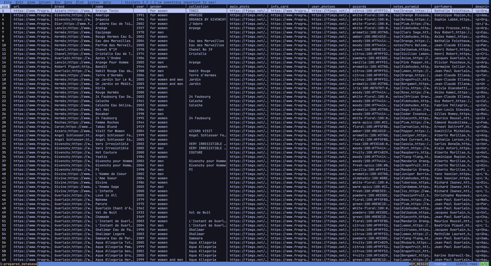
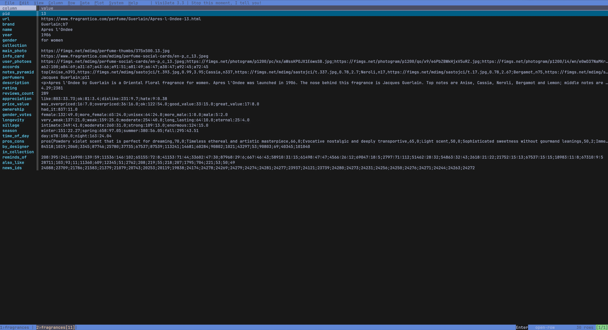

# FragDB - Fragrance Database

The most comprehensive fragrance database available, containing detailed information on **119,000+ perfumes and colognes**.

[](LICENSE.md)
[](https://fragdb.net)
[](DATA_DICTIONARY.md)

## Overview

FragDB provides structured data for the fragrance industry including:

- **119,000+** fragrances from **7,200+** brands
- **28 data fields** per fragrance
- Accords with visual color codes
- Notes pyramid (top, middle, base)
- Community ratings and votes
- Longevity, sillage, and seasonal data
- Perfumer information
- Similar fragrance recommendations

## Preview

<p align="center">
  
  &nbsp;&nbsp;
  
</p>

<p align="center">
  <em>Table View</em> &nbsp;&nbsp;&nbsp;&nbsp;&nbsp;&nbsp;&nbsp;&nbsp;&nbsp;&nbsp;&nbsp;&nbsp;&nbsp;&nbsp;&nbsp;&nbsp;&nbsp;&nbsp;&nbsp;&nbsp;&nbsp;&nbsp;&nbsp;&nbsp;&nbsp;&nbsp;&nbsp;&nbsp;&nbsp;&nbsp;&nbsp;&nbsp;&nbsp;&nbsp;&nbsp;&nbsp;&nbsp;&nbsp;&nbsp;&nbsp;&nbsp;&nbsp;&nbsp;&nbsp;&nbsp;&nbsp;&nbsp;&nbsp;&nbsp;&nbsp;&nbsp;&nbsp;&nbsp;&nbsp;&nbsp;&nbsp;&nbsp;&nbsp;&nbsp;&nbsp;&nbsp;&nbsp;&nbsp;&nbsp; <em>Detail View</em>
</p>

## Quick Start

### Python

```python
import pandas as pd

# Load the database
df = pd.read_csv('SAMPLE.csv', sep='|', encoding='utf-8')

# Search by name
results = df[df['name'].str.contains('Aventus', case=False, na=False)]
print(results[['name', 'brand', 'year']])
```

### JavaScript

```javascript
const { parse } = require('csv-parse/sync');
const fs = require('fs');

const records = parse(fs.readFileSync('SAMPLE.csv', 'utf-8'), {
  columns: true,
  delimiter: '|'
});

console.log(`Loaded ${records.length} fragrances`);
```

### SQL

```sql
-- PostgreSQL/MySQL
CREATE TABLE fragrances (
    pid INTEGER PRIMARY KEY,
    name VARCHAR(500),
    brand VARCHAR(500),
    -- ... see full schema in examples/sql/
);

-- Load with pipe delimiter
\copy fragrances FROM 'fragdb.csv' WITH (FORMAT csv, DELIMITER '|', HEADER);
```

See [examples/](examples/) for complete code in Python, JavaScript, SQL, and R.

## Data Structure

All 28 fields included in FragDB:

### Identity & Basic Info
| Field | Description | Format |
|-------|-------------|--------|
| `pid` | Unique fragrance identifier | Integer: `9828` |
| `url` | Direct link to fragrance page | URL: `https://www.fragrantica.com/perfume/Creed/Aventus-9828.html` |
| `brand` | Brand name, page URL, logo URL | `Creed;https://...;https://...` |
| `name` | Fragrance name | Text: `Aventus` |
| `year` | Release year | Integer: `2010` |
| `gender` | Target gender | `for men`, `for women`, `for women and men` |
| `collection` | Collection within brand | Text: `Aventus` |

### Media
| Field | Description | Format |
|-------|-------------|--------|
| `main_photo` | Main bottle photo URL | URL |
| `info_card` | Social card image URL | URL |
| `user_photoes` | User-submitted photos | Semicolon-separated URLs |

### Composition
| Field | Description | Format |
|-------|-------------|--------|
| `accords` | Scent accords with strength & colors | `fruity:100:#FC4B29:#000;woody:67:#774414:#FFF;...` |
| `notes_pyramid` | Notes by layer (top/middle/base) | `top(Bergamot,url,img;...)middle(...)base(...)` |
| `perfumers` | Creator name, page URL, photo | `Erwin Creed,https://...,https://...` |
| `description` | Fragrance description | HTML text |

### Ratings & Votes
| Field | Description | Format |
|-------|-------------|--------|
| `rating` | Average rating & vote count | `4.33;24561` |
| `appreciation` | Love/like/ok/dislike/hate votes | `love:100;like:42.23;ok:11.85;...` |
| `price_value` | Price perception votes | `way_overpriced:6658;overpriced:2844;ok:1360;...` |
| `ownership` | Ownership status votes | `have_it:52.82;had_it:12.32;want_it:34.86` |
| `gender_votes` | Gender suitability votes | `female:149;unisex:866;male:7977;...` |
| `longevity` | Duration votes | `very_weak:784;weak:1459;moderate:5869;long_lasting:5726;eternal:1614` |
| `sillage` | Projection votes | `intimate:1816;moderate:8139;strong:4289;enormous:1267` |
| `season` | Seasonal suitability | `winter:44.39;spring:97.60;summer:99.48;fall:74.81` |
| `time_of_day` | Day/night suitability | `day:100.00;night:68.93` |

### Related Fragrances
| Field | Description | Format |
|-------|-------------|--------|
| `by_designer` | Other fragrances from same brand | Semicolon-separated PIDs |
| `in_collection` | Other fragrances in same collection | Semicolon-separated PIDs |
| `reminds_of` | "This reminds me of..." fragrances | Semicolon-separated PIDs |
| `also_like` | "Users also like..." fragrances | Semicolon-separated PIDs |
| `news_ids` | Related news article IDs | Semicolon-separated IDs |

**[View complete data dictionary with parsing examples →](DATA_DICTIONARY.md)**

## Sample Data

The free sample includes **10 fragrances** with all 28 fields:

- [SAMPLE.csv](SAMPLE.csv) - Pipe-delimited CSV
- [SAMPLE_PREVIEW.md](SAMPLE_PREVIEW.md) - Human-readable preview

## Code Examples

| Language | Files | Description |
|----------|-------|-------------|
| Python | [examples/python/](examples/python/) | Pandas loading, search, parsing, recommendations |
| JavaScript | [examples/javascript/](examples/javascript/) | Node.js parsing, Express API |
| SQL | [examples/sql/](examples/sql/) | PostgreSQL/MySQL schemas, queries |
| R | [examples/r/](examples/r/) | Analysis, visualization with tidyverse |

## Documentation

- [DATA_DICTIONARY.md](DATA_DICTIONARY.md) - Complete field documentation
- [docs/INTEGRATION_GUIDE.md](docs/INTEGRATION_GUIDE.md) - Platform integration guide
- [docs/USE_CASES.md](docs/USE_CASES.md) - Industry use cases
- [docs/FAQ.md](docs/FAQ.md) - Frequently asked questions
- [docs/API_COMPARISON.md](docs/API_COMPARISON.md) - Comparison with alternatives

## Use Cases

- **E-commerce**: Enrich product listings with detailed fragrance data
- **Mobile Apps**: Build fragrance collection managers or discovery apps
- **Data Analysis**: Analyze fragrance industry trends
- **Recommendations**: Build content-based or collaborative filtering systems
- **Content Creation**: Power blogs, videos, and reviews with accurate data

## Full Database

The free sample contains 10 rows. The full FragDB database includes:

| Feature | Free Sample | Full Database |
|---------|-------------|---------------|
| Fragrances | 10 | 119,000+ |
| Brands | ~8 | 7,200+ |
| Data Fields | 28 | 28 |
| Updates | None | Regular |
| Commercial Use | Yes (sample) | Yes (licensed) |

### Pricing

| Plan | Price | Includes |
|------|-------|----------|
| One-Time Purchase | $200 | Complete database, 6 downloads, 3-day access |
| Annual Subscription | $1,000/year | 3 updates per month (36 total), always latest data |
| Lifetime Access | $2,000 | Unlimited updates forever, priority support |

**[Purchase at fragdb.net →](https://fragdb.net)**

## Contributing

Contributions are welcome! See [CONTRIBUTING.md](CONTRIBUTING.md) for guidelines.

- Bug fixes for code examples
- New language examples
- Documentation improvements
- Use case additions

## License

- **Sample Data & Code**: [MIT License](LICENSE.md)
- **Full Database**: Commercial license (see [fragdb.net](https://fragdb.net))

## Links

- **Website**: [fragdb.net](https://fragdb.net)
- **Documentation**: [DATA_DICTIONARY.md](DATA_DICTIONARY.md)
- **Issues**: [GitHub Issues](../../issues)

---

Built with data passion by the FragDB team.
