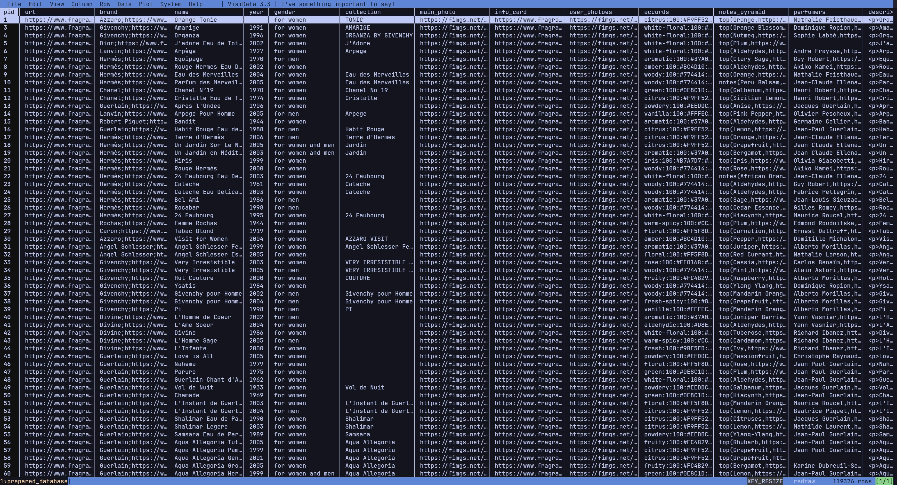
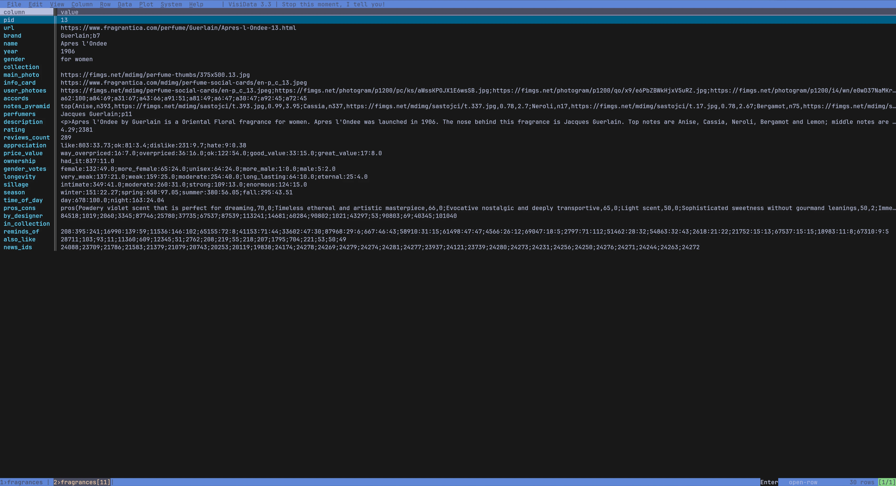
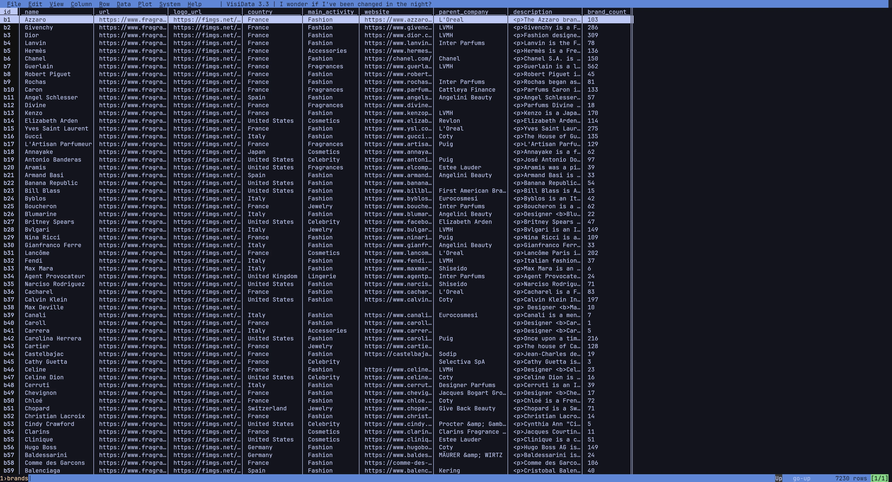
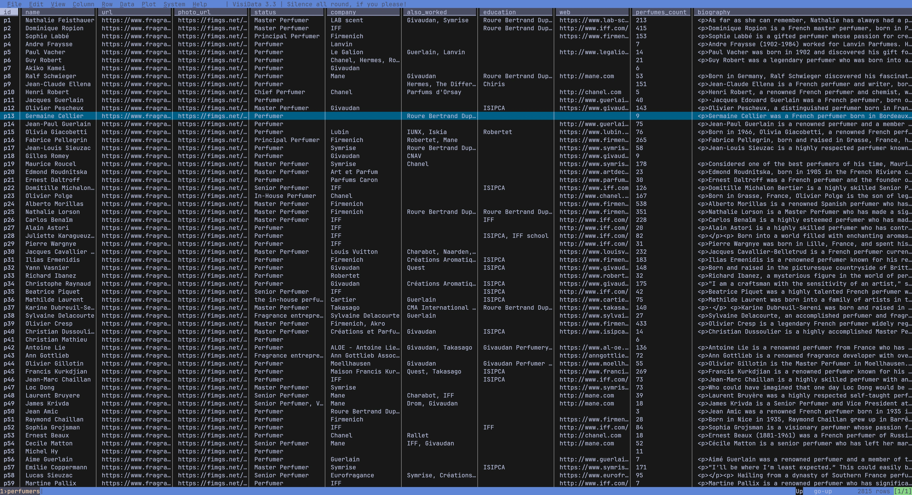
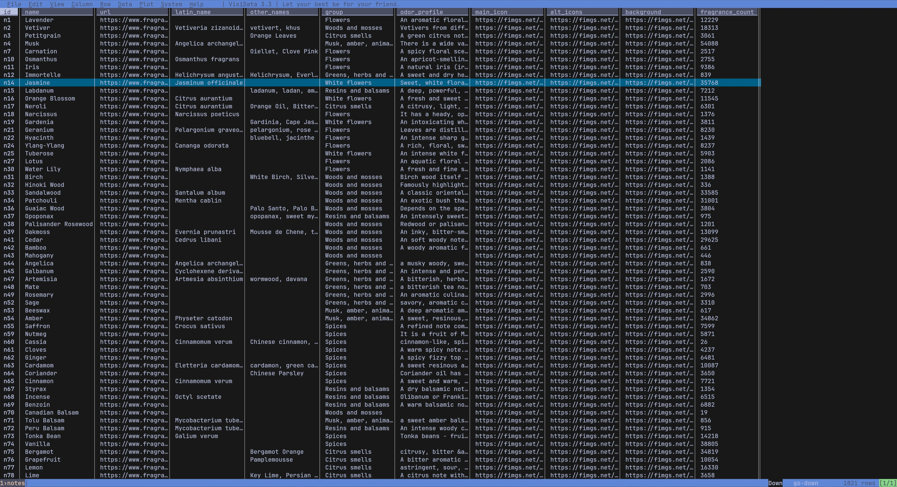
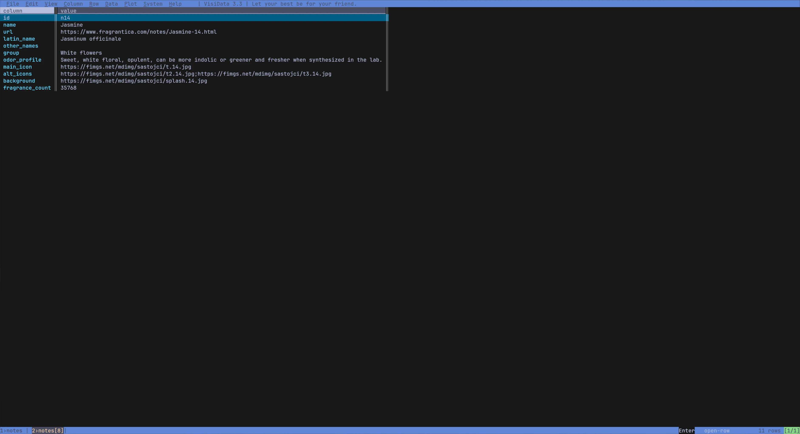

# FragDB - Fragrantica Fragrance Database

The most comprehensive fragrance database available, containing **140,700+ records** across six interconnected CSV files with **23 language translations**.

[](LICENSE.md)
[](https://fragdb.net)
[](DATA_DICTIONARY.md)
[](DATA_DICTIONARY.md)

## Overview

FragDB provides structured data for the fragrance industry:

| File | Records | Fields | Description |
|------|---------|--------|-------------|
| `fragrances.csv` | 127,579 | 30 | Main fragrance database |
| `brands.csv` | 7,609 | 54 | Brand profiles + translations |
| `perfumers.csv` | 2,905 | 36 | Perfumer profiles + translations |
| `notes.csv` | 2,508 | 55 | Fragrance notes + translations |
| `accords.csv` | 92 | 27 | Accords + translations |
| `translations.csv` | 34 | 25 | Vocabulary: gender & voting labels × 23 languages |

### Key Features

- **23 languages** — English + 22 translations for all labels, note names, accords, countries, statuses
- **Relational structure** — Files linked via unique IDs
- **Rich fragrance data** — Notes pyramid, accords, ratings, votes
- **Brand profiles** — Logo, country, website, parent company (country/activity translated)
- **Perfumer profiles** — Photo, status, company, education, biography (status translated)
- **Notes reference** — 2,508 notes with translations, Latin names, groups, odor profiles
- **Accords reference** — Display colors + translated names
- **Translation vocabulary** — 34 entries for gender and voting labels
- **Pipe-delimited CSV** — Easy parsing, UTF-8 encoded

## Preview

### Fragrances

<p align="center">
  
  &nbsp;&nbsp;
  
</p>

### Brands & Perfumers

<p align="center">
  
  &nbsp;&nbsp;
  
</p>

### Notes

<p align="center">
  
  &nbsp;&nbsp;
  
</p>

## Quick Start

### Python

```python
import pandas as pd

# Load all files
fragrances = pd.read_csv('fragrances.csv', sep='|', encoding='utf-8')
brands = pd.read_csv('brands.csv', sep='|', encoding='utf-8')
notes = pd.read_csv('notes.csv', sep='|', encoding='utf-8')
translations = pd.read_csv('translations.csv', sep='|', encoding='utf-8')

# Join fragrances with brands
fragrances['brand_id'] = fragrances['brand'].str.split(';').str[1]
df = fragrances.merge(brands, left_on='brand_id', right_on='id', suffixes=('', '_brand'))

# Translate gender to any language
trans = translations.set_index('id')
df['gender_ru'] = df['gender'].map(lambda x: trans.loc[x, 'ru'] if x in trans.index else x)

# Brand country in Japanese
print(df[['name', 'name_brand', 'country_ja', 'gender_ru']].head())
```

### JavaScript

```javascript
const { parse } = require('csv-parse/sync');
const fs = require('fs');

// Load files
const fragrances = parse(fs.readFileSync('fragrances.csv', 'utf-8'), { columns: true, delimiter: '|' });
const brands = parse(fs.readFileSync('brands.csv', 'utf-8'), { columns: true, delimiter: '|' });
const translations = parse(fs.readFileSync('translations.csv', 'utf-8'), { columns: true, delimiter: '|' });

// Build lookup maps
const brandsMap = new Map(brands.map(b => [b.id, b]));
const transMap = new Map(translations.map(t => [t.id, t]));

// Get fragrance with translated fields
const frag = fragrances[0];
const [brandName, brandId] = frag.brand.split(';');
const brand = brandsMap.get(brandId);
const genderRu = transMap.get(frag.gender)?.ru || frag.gender;

console.log(`${frag.name} by ${brandName} (${brand?.country_ru}), ${genderRu}`);
```

### SQL (PostgreSQL)

```sql
-- Import
COPY fragrances FROM 'fragrances.csv' DELIMITER '|' CSV HEADER ENCODING 'UTF8';
COPY brands FROM 'brands.csv' DELIMITER '|' CSV HEADER ENCODING 'UTF8';
COPY translations FROM 'translations.csv' DELIMITER '|' CSV HEADER ENCODING 'UTF8';

-- Join and translate gender to Russian
SELECT f.name, b.name AS brand, b.country_ru, t.ru AS gender_ru
FROM fragrances f
JOIN brands b ON SPLIT_PART(f.brand, ';', 2) = b.id
JOIN translations t ON f.gender = t.id;
```

See [DATA_DICTIONARY.md](DATA_DICTIONARY.md) for complete field documentation.

## What's New in v5.0

- **23 languages** — all labels, note names, accords, countries, statuses translated
- **translations.csv** — new vocabulary file for gender values and voting labels
- **Compact notes pyramid** — `note_id,opacity,weight` (name/icon via notes.csv JOIN)
- **2,508 notes** — each name variant (Rose, Damask Rose, Turkish Rose) has its own ID
- **Gender & voting fields** use translation IDs instead of English text

See [DATA_DICTIONARY.md](DATA_DICTIONARY.md) for complete field documentation with parsing examples.

## Sample Data

The free sample includes **10 records per file** across all six CSV files:

| File | Records | Description |
|------|---------|-------------|
| [fragrances.csv](samples/fragrances.csv) | 10 | Iconic fragrances (30 fields) |
| [brands.csv](samples/brands.csv) | 10 | Brand profiles (54 fields, 22 lang) |
| [perfumers.csv](samples/perfumers.csv) | 10 | Perfumer profiles (36 fields, 22 lang) |
| [notes.csv](samples/notes.csv) | 10 | Fragrance notes (55 fields, 22 lang) |
| [accords.csv](samples/accords.csv) | 10 | Accords with colors (27 fields, 22 lang) |
| [translations.csv](samples/translations.csv) | 34 | Gender & voting vocabulary (full, 25 fields) |

Preview: [SAMPLE_PREVIEW.md](SAMPLE_PREVIEW.md)

## Documentation

- [DATA_DICTIONARY.md](DATA_DICTIONARY.md) — Complete field documentation with parsing examples
- [CHANGELOG.md](CHANGELOG.md) — Version history

## Use Cases

- **E-commerce**: Enrich product listings with detailed fragrance data
- **Mobile Apps**: Build fragrance collection managers or discovery apps
- **Data Analysis**: Analyze fragrance industry trends by brand, country, perfumer
- **Recommendations**: Build content-based or collaborative filtering systems
- **Content Creation**: Power blogs, videos, and reviews with accurate data

## Full Database

The free sample contains 10 records per file. The full FragDB database includes:

| Feature | Free Sample | Full Database |
|---------|-------------|---------------|
| Fragrances | 10 | 127,579 |
| Brands | 10 | 7,609 |
| Perfumers | 10 | 2,905 |
| Notes | 10 | 2,508 |
| Accords | 10 | 92 |
| Translations | 34 (full) | 34 |
| Languages | 23 | 23 |
| Total Records | 84 | 140,727 |
| Updates | None | Regular |
| Commercial Use | Yes (sample) | Yes (licensed) |

**[Purchase at fragdb.net →](https://fragdb.net)**

## Contributing

Contributions are welcome! See [CONTRIBUTING.md](CONTRIBUTING.md) for guidelines.

- Bug fixes for code examples
- New language examples
- Documentation improvements
- Use case additions

## License

- **Sample Data & Code**: [MIT License](LICENSE.md)
- **Full Database**: Commercial license (see [fragdb.net](https://fragdb.net))

## Links

- **Website**: [fragdb.net](https://fragdb.net)
- **Kaggle**: [kaggle.com/datasets/eriklindqvist/fragdb-fragrance-database](https://www.kaggle.com/datasets/eriklindqvist/fragdb-fragrance-database)
- **Hugging Face**: [huggingface.co/datasets/FragDBnet/fragrance-database](https://huggingface.co/datasets/FragDBnet/fragrance-database)
- **Documentation**: [DATA_DICTIONARY.md](DATA_DICTIONARY.md)
- **Issues**: [GitHub Issues](../../issues)

---

Built with data passion by the FragDB team.
